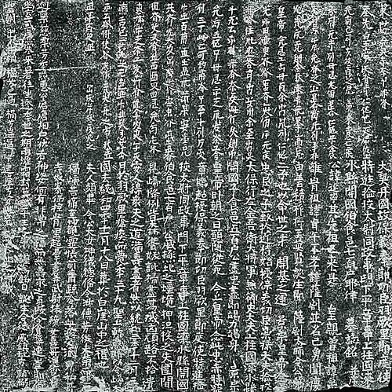
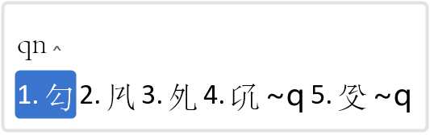
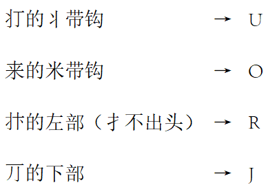
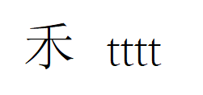

# khitan_large_script_wubi
基于Rime的契丹大字五笔输入方案

A Rime-based Wubi input schema for the Khitan Large Script

## 一、概述

​	本输入方案基于输入法内核Rime，提供.dict码表、.schema配置文件和.ico图标。使用时需先下载安装Rime，再挂载本方案的码表、配置文件和图标。

## 二、背景

​	契丹大字是契丹人的民族文字。辽朝建国后，神册五年(920)正月，耶律阿保机命耶律突吕不、耶律鲁不古等创制契丹文字。九月，创制完成，并颁布实行，即契丹大字。契丹大字是根据汉字隶书笔划增减而成的。但由于契丹大字借用汉字形式，书写繁杂且缺乏表音功能，难以适应日常交流需求，因此迅速被后来发明、更为简便科学的契丹小字所边缘化。因此，契丹大字仅多用于刻石记功、墓志铭、符牌印章等官方场合，无法做到广泛使用。

​	终辽一代，契丹大字与契丹小字、汉字等一直并行于辽朝境内。后来的西辽也继续使用汉字和契丹文字，直至亡国。

​	1125年，金朝灭辽。金朝虽然创制了女真文字，但其前半期在使用女真文字和汉字的同时，仍使用两种契丹文字。直到金章宗明昌二年四月十六日（1191年5月10日），罢免国史院专写契丹文的官员；同年十二月十一日（12月28日）“诏罢契丹字”。

​	元朝初年，契丹大、小字仍偶有使用，但其后废弃，也少有契丹文书籍传世。

​	契丹大字是一种表意文字，造字逻辑类似汉字。其单字总数多达一千余字，因缺乏表音规律，目前绝大多数尚未破译。在结构上，契丹大字通过增减汉字笔画而创制，呈现独立的方块形态，与汉字结构几无二致，因此能够完美适配五笔输入法。

​	目前，契丹大字的输入法已有[仓颉输入法、笔画输入法](http://www.ccamc.co/fonts_kht_jrc.php)。加上本五笔方案，共有三种输入方案可供用户选择。

## 三、使用步骤（Win11）

1. 下载并安装契丹大字字体，如[CCAMC Khitan & Jurchen Std]([契丹文、女真文 | 字體和输入法 | 古今文字集成](http://www.ccamc.co/fonts_kht_jrc.php))（本方案依照该字体制作，换用其他字体时可能会出现部分生僻字符无法显示的情况）。
2. 下载[Rime输入法内核](https://rime.im/)并安装。
3. 右键Rime状态栏，选择并打开“用户文件夹”，将本项目的.yaml和.ico文件复制到该目录。
4. 右键Rime状态栏，选择“输入法设置”，并勾选“契丹大字五笔”。
5. 右键Rime状态栏，选择“重新部署”。
6. 按下ctrl+~，选择“契丹大字五笔”。
7. 正常使用。将打出字符的字体改为已安装的契丹大字字体，即可正常显示。

​	以上是Win11的使用步骤，其他平台的步骤类似，具体可参照Rime官方配置文档。

## 四、输入方案介绍

​	本输入方案基于五笔86版，输入规则已尽量贴合原版，仅增加了几个易推导的字根，以最大程度上降低使用门槛。末笔识别码、取末笔规则（取折还是撇）均与86版相同。

​	本方案支持字符+部首共2276个（包含大量重复编码字）。

​	输入演示如下图：

#### 1. 字根改动：

​	新增的字根均是原版字根作轻微变形，极易类比、推导。

#### 2. 取码情况

​	本输入方案仅支持不加识别码的全码及全码，不考虑简码。

​	键名字符需打全码，如

#### 3. 重复编码字

​	由于过去在字符录入时出现识别讹误，导致有大量字形相同的字被录入了不同编码（下图是其中一部分）。为了最大化兼容，本方案支持输入重复的废弃字，但将其权重调至最低。

#### 4. 重码统计

​	据统计，全部的2276个字符中，有136组272字的两码均重，但可依靠取码顺序强行区分。另有109组313字无法区分（除去重复编码字）。

## 五、后记

​	本人是五笔爱好者，意图用五笔实现所有东亚汉字系文字的流畅输入。契丹文是小众中的小众，本输入方案也不会有多少实际应用价值。但能实现爱好就足矣 ٩(๑•̀ω•́๑)۶

​	方案制作仓促，如有发现编码错误或其他问题，请直接联系我：matiasxebec@gmail.com。

## 支持

感谢[古今文字集成](http://www.ccamc.co/)及站长Jerry的相关信息、字体的支持！

感谢五笔输入法的开发者王永民先生。

感谢Rime输入法内核的开发者们。
